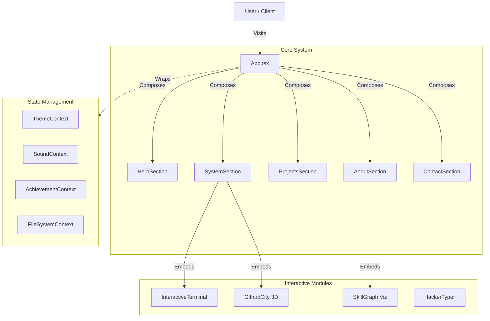

<div align="center">

# ⚡ SYSTEM_OVERRIDE: PORTFOLIO_V2.0 ⚡

[](https://git.io/typing-svg)


<br/>

> *"The only limit is your imagination. And maybe RAM."*

</div>

---

## 📡 SYSTEM_STATUS

This portfolio is not just a website; it's an **interactive experience**. Designed with a dual-personality engine, it switches seamlessly between a clean, professional **Corporate Mode** and a chaotic, immersive **Hacker Mode**.

### 🚀 CORE_FEATURES

| MODULE | STATUS | DESCRIPTION |
| :--- | :---: | :--- |
| **Dual Theme Engine** | ✅ | Toggle between `Light/Corporate` and `Dark/Hacker` modes with CRT effects. |
| **Interactive Terminal** | ✅ | Fully functional `zsh`-like terminal with custom commands (`ls`, `help`, `whoami`). |
| **Skill Graph Viz** | ✅ | Physics-based force-directed graph visualization of technical skills. |
| **GitHub City** | ✅ | 3D visualization of commit history as a procedural city. |
| **Konami Code** | ✅ | Try `↑ ↑ ↓ ↓ ← → ← → B A` for a surprise. |
| **Gamification** | ✅ | Achievement system, typing games, and hidden easter eggs. |

---

## 🏗️ SYSTEM_ARCHITECTURE



---

## 💾 INSTALLATION_PROTOCOL

Initialize the local environment by executing the following command sequence:

```bash
# 1. Clone the repository
git clone https://github.com/Moussandou/Portfolio.git

# 2. Navigate to the system directory
cd Portfolio

# 3. Install dependencies
npm install

# 4. Initiate development server
npm run dev
```

> **WARNING**: High GPU usage may occur when `GithubCity` or `SkillGraph` modules are active. Ensure hardware acceleration is enabled.

---

## 📂 DIRECTORY_STRUCTURE

```bash
src/
├── components/         # UI Components & Visualizations
│   ├── sections/       # Main Page Sections (Hero, About, etc.)
│   ├── SkillGraph.tsx  # Physics-based Graph Engine
│   ├── GithubCity.tsx  # 3D Commit Visualization
│   └── ...
├── context/            # Global State (Theme, Sound, Achievements)
├── data/               # Static Data (Projects, Experience)
├── hooks/              # Custom React Hooks
├── lib/                # Utilities & Firebase Config
└── styles/             # Global Styles & Tailwind Config
```

---

## 🎮 HIDDEN_COMMANDS

Access the **Terminal** section and try these commands:

- `help`: List available commands.
- `whoami`: Display user identity.
- `matrix`: Toggle the Matrix rain effect.
- `clear`: Clear the terminal buffer.
- `sudo`: [ACCESS DENIED]

---

<div align="center">

### 🌐 CONNECT_UPLINK

[](https://linkedin.com/in/moussandou)
[](https://github.com/moussandou)
[](mailto:moussandou.mroivili@epitech.eu)

**© 2025 Moussandou Mroivili. All Systems Operational.**

</div>
